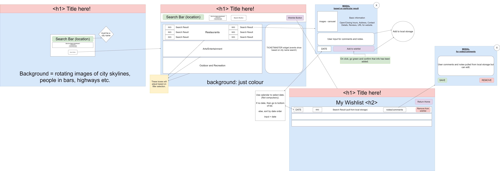
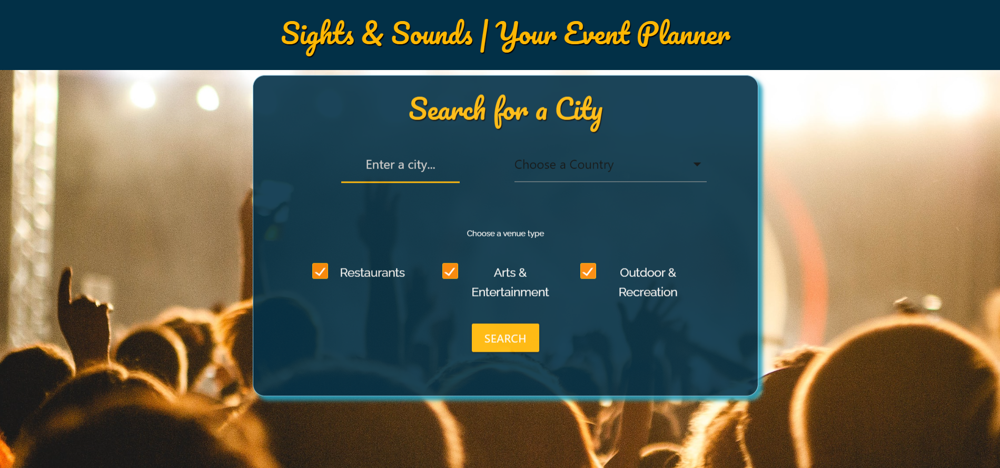
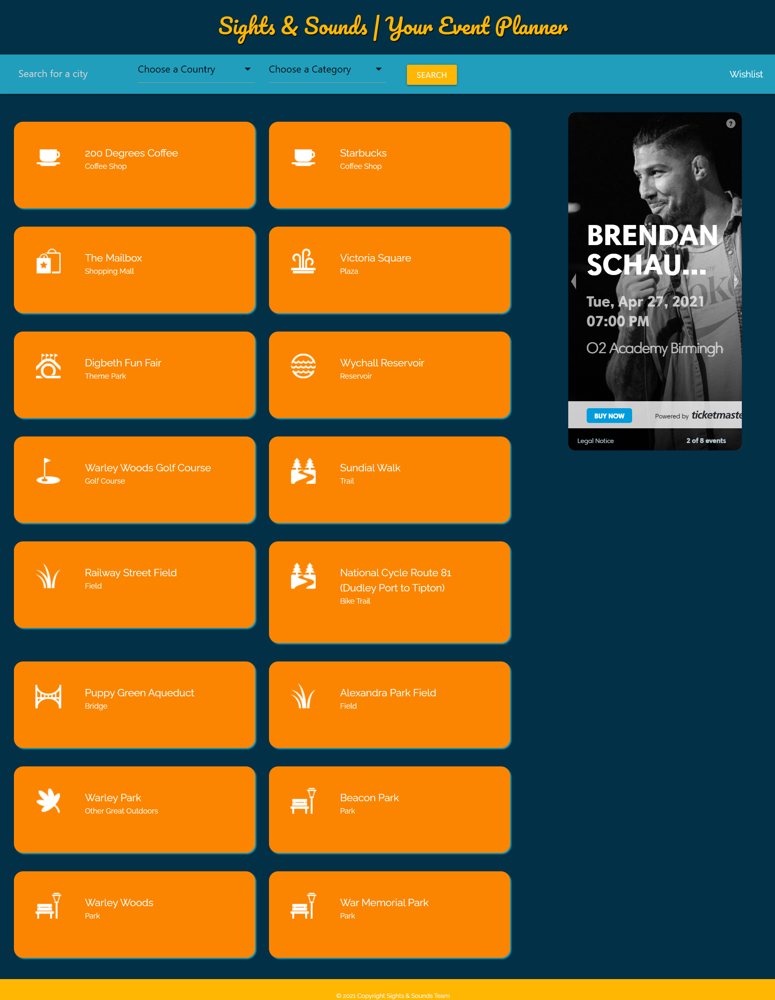
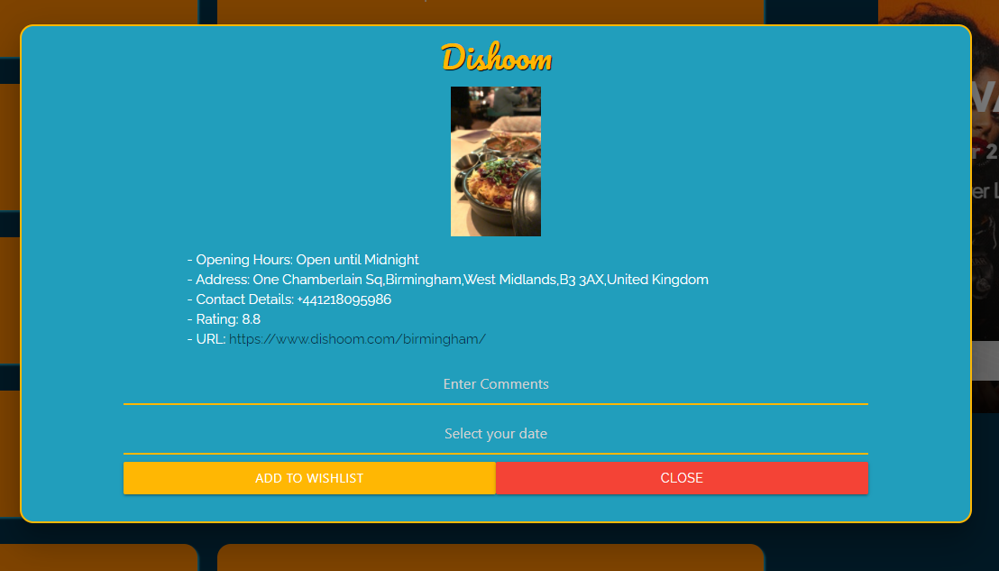
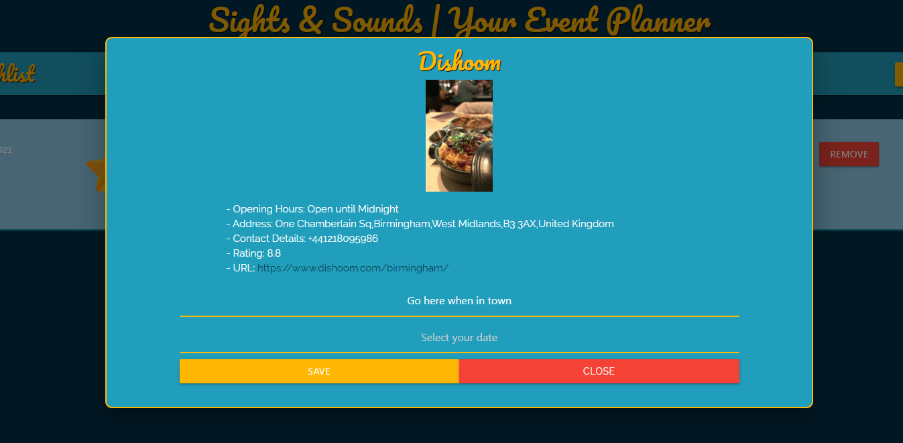
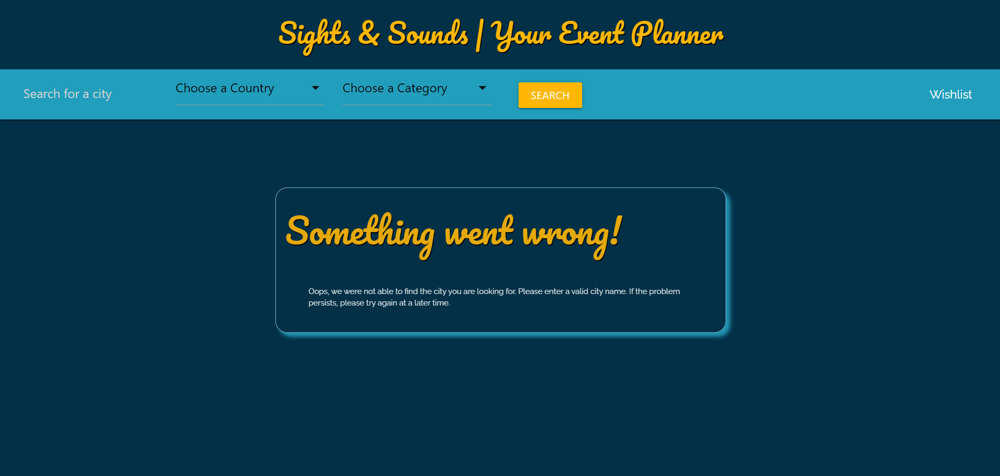

# Sights & Sounds

## Introduction

**Sights & Sounds** allows you to easily find events and venues, based on your selected location. You can then save the ones you are interested in to your wishlist and - Voila! Your weekend plans are already looking a lot more exciting!

## Table of Contents

[Introduction](#introduction)  
 [Table of Contents](#table-of-contents)  
 [Description](#description)  
 [User Story](#user-story)  
 [Deployed Link to Application](#deployed-link-to-application)  
 [Getting Started](#getting-started)  
 [Tech](#tech)  
 [Wire Frames](#wire-frames)  
 [Screenshots](#screenshots)  
[Future Improvements](#future-improvements)
[License](#license)
[Contact Us](#contact-us)

## Description

Our team of developers was tasked with building a Web Application that would help the user find Venues and Events in a certain city.

When the user first opens the application, he will be presented with a form that accepts input for a city, country and preferred filters (Restaurants, Arts & Entertainment or Outdoor & Recreation) and a SEARCH button;

When the user submits his preferred city and filters, the page will be emptied, in its place being loaded the search results page with its navbar containing a search form and a link to the wishlist page, the results cards and the Ticketmaster Widget;

When the user clicks on one of the results, a modal pops up containing extra information: Name and Photo of the Venue, Opening Hours, Address, Contact Details, Rating, URL, an Input Field for adding comments, a Date Picker, an ADD TO WISHLIST button and a CLOSE button;

When the user wants to add a venue to the Wishlist, he can type in a comment, select a date and, on click of the ADD TO WISHLIST button, the venue information will be saved in the Local Memory;

When the user wants to attend an event displayed on the Ticketmaster Widget, he can use the built-in BUY NOW button and he will be redirected to the page selling tickets for that specific event;

When the user chooses to search for another city, he can perform the search completing the form in the navbar, without needing to reload the landing page;

When the user clicks on the WISHLIST button, he will be redirected to the Wishlist page;

When loading the Wishlist Page, the user will be presented with cards displaying all of the venues he previously saved;

Every card will display a date (if previously typed in by the user), an icon, the name of the venue, a DETAILS button and a REMOVE button;

On click of the DETAILS button, a modal will pop up containing the name of the venue, a photo taken at the venue, a short description (if available), the opening hours, the address, the contact details, the rating, the url, the comment previously added by the user (if available), the date (if available) a SAVE button and a CLOSE button;

If the user chooses to update the comment, he can do so by typing his preferred comment over the previous one and save it by clicking the SAVE button;

When the user chooses to remove a venue from the Wishlist, he can do so by clicking the REMOVE button that is displayed on the card;

When the user decides to search for another city he can do so by clicking on the RETURN HOME button;

## User Story

```
AS A user
I WANT to enter the city and country of a location I want to visit
SO THAT I can see what venues are in that area

AS A user
I WANT to be able to filter the venue type by Restaurant, Arts and Entertainment, and Outdoor and Recreation
SO THAT I only view the venues that I am interested in

AS A user
I WANT to click on a venue to see more details about that venue
SO THAT I can decide whether I want to visit this venue

AS A user
I WANT to save a venue to my wishlist
SO THAT I can view my saved venues at another time

AS A user
I WANT to add a comment to the venues added to my wishlist
SO THAT I can make notes about the venue

AS A user
I WANT to add a date to the venues added to my wishlist
SO THAT I can see when I am planning to visit that venue

AS A user
I WANT search for a new city and country from the search results page without having to revisit the landing page
SO THAT searching for a new city is quick and easy

AS A user
I WANT to see a list of my saved venues in chronological order on the wishlist page
SO THAT I can see when I am planning to visit each venue

AS A user
I WANT to view the events in the area I have searched for with a link to book a ticket for the event
SO THAT I can view be linked to current events in the area
```

## Deployed Link to Application

Click [here](https://chelseanicholls95.github.io/event-planner/) to view our project!

## Getting Started

```
git clone git@github.com:chelseanicholls95/event-planner.git
cd event-planner
code .
```

## Tech

### CSS Framework - [Materialize](https://materializecss.com/)

We used Materialize to create various elements in our application. A variety of Materialize classes were used to create the following elements:

- The form on the landing page was made using a combination of [text inputs](https://materializecss.com/text-inputs.html), [select elements](https://materializecss.com/select.html), [checkboxes](https://materializecss.com/checkboxes.html), and [buttons](https://materializecss.com/buttons.html).
- The [navigation bar](https://materializecss.com/navbar.html) using the same elements as the form as well as a [multiple select dropdown](https://materializecss.com/select.html).
- The search results cards using the Materialize card elements.
- The modal on the search results page and the wishlist page was created using the [Materialize modal element](https://materializecss.com/modals.html) and accompanying JavaScript. We also added a [text input](https://materializecss.com/text-inputs.html) and a [date picker](https://materializecss.com/pickers.html) from Materialize to the modals.

### Foursquare - [Places API](https://developer.foursquare.com/docs/places-api/)

The main API that we use in this application is the Foursquare Places API. In order to use this API, we had to create an account and were assigned a CLIENT_ID and a CLIENT_SECRET. This is added to every url used when fetching the data.

When the user searches for a city and a country, we use the [search endpoint](https://developer.foursquare.com/docs/venues/search) to get venues in that area. This uses the near parameter to search for venues near the requested city. We have narrowed down the search to three categories: Restaurants, Arts and Entertainment and Outdoor and Recreation using the categoryId parameter. This endpoint returns information such as venue name, venue id, venue type and an icon depending on the type of venue. This information is used to render the search results cards.

When the user clicks on a venue, we use the [venue endpoint](https://developer.foursquare.com/docs/api-reference/venues/details) to get more details about that particular venue. This requires the venue ID that we retrieve from the search request. The venue endpoint returns information such as opening hours, contact information, address, website urls, images etc. We then render this information onto the modal.

### Ticketmaster - [Event Discovery Widget](https://developer.ticketmaster.com/products-and-docs/widgets/event-discovery/)

The Ticketmaster API was the API used to generate the widget on the right-hand side of the page. To use this API we needed an API key which was acquired by creating an account.

To use the Event Discovery Widget, we rendered the code that was provided to us on the search results page and passed in the city and country code that was selected by the user. The widget allows the user to scroll through events local to the location entered and provides a link for them to book a ticket for an event.

## Wire Frames

We used draw.io to create the wire frames for our application. We started with a very high-level design, laying out what elements we would like on the page and where we would like to put them. At this stage, we also decided what elements would be linked to javascript functions and what would happen when buttons are clicked or forms are submitted.


Click [here](https://app.diagrams.net/#Hchelseanicholls95%2Fevent-planner%2Fmaster%2FEvent-Planner.drawio) to view on draw.io

## Screenshots

Landing Page


Search Results Page


Search Results Modal


Wishlist Page


Wishlist Modal


Error Message


## Future Improvements

We have some areas that we feel that we could improve on. Firstly, the multiple select dropdown on the navbar displays ‘choose a category’ even after you have selected a category. We tried to remove this but the materialize multiple select element is designed this way. If we were to create this application again, we would find a CSS framework that has a design that is more in-line with what we would like or design the dropdown ourselves.

Secondly, our initial plan was to separate the search results into categories. This was mentioned as one of the challenges earlier. The endpoints that we called from the API did not give us the required information to separate the venues into categories. If we were to create this application again, we would explore more endpoints and parameters in the Foursquare API to investigate whether we can separate the results.

In the future, we would like to expand on the application and add more features. One of these would be links to social media such as Facebook, Twitter, Instagram etc. This would enable the user to like the venue, share their plans to visit a venue and share their experiences at the venue. This could also allow for collaboration with friends to make plans.

We would also like to expand on our use of the Ticketmaster API and have a more in-depth search for the events that are happening in that area. We would add a ‘view more events’ button underneath the widget which would take the user to a new page and show the events in more detail. The user would also be able to input a date and the search will be narrowed to around that date.

## License

This project is licensed under the MIT license.

## Contact Us

- Visit our GitHub profiles:
  - [Chelsea Nicholls](https://github.com/chelseanicholls95)
  - [Lee Farnell](https://github.com/LeeFarnell)
  - [Misha Shtebunaeva](https://github.com/misha244)
  - [Nazim Rasheed](https://github.com/MRasheed1991)
  - [Tudor Tocan](https://github.com/ttudorandrei)
